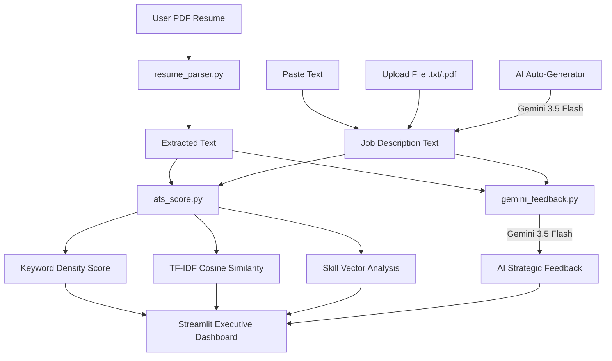

# ✦ AI Resume Analyzer — Executive ATS Intelligence 💼

[](https://www.python.org/)
[](https://streamlit.io/)
[](https://ai.google.dev/)
[](LICENSE)

An **AI-powered Executive ATS (Applicant Tracking System) Evaluation Dashboard** built with Python and Streamlit. It scores resumes against job descriptions using structural skill matching, TF-IDF semantic vector similarity, and Google Gemini AI insights.

---

## 🌟 Key Features

- **✦ Organic Dark Luxury UI / UX**: Styled with an executive **Warm Espresso & Copper** glassmorphism aesthetic, frosted containers, and soft glowing accents.
- **📄 PDF Resume Parsing**: Extracts raw text from uploaded multi-page PDF resumes using `pdfplumber`.
- **🎯 Flexible Job Description Input**:
  - **Paste Text**: Direct copy-paste of job requirements.
  - **Upload File**: Supports `.txt` and `.pdf` job description documents.
  - **Auto-Generate with AI**: Generates targeted, industry-standard job descriptions using Gemini AI based on **Job Title** and **Expected Experience**.
- **📊 Comprehensive ATS Match Scoring**:
  - **Overall ATS Score**: Weighted metric combining structural keyword density and semantic vector similarity.
  - **Keyword Match Percentage**: Measures exact overlap against a curated technical skill dictionary.
  - **Semantic Similarity Percentage**: Calculates TF-IDF vector cosine similarity to evaluate contextual alignment.
- **🏷️ Skill Vector Breakdown**:
  - **✓ Matched Skills**: Core competencies present in both resume and target role.
  - **✕ Missing Skills**: Crucial qualifications missing from the resume.
  - **+ Additional Skills**: Bonus qualifications present in the resume.
- **🤖 Gemini AI Executive Insights**:
  - Structural rewrite recommendations.
  - Action verb enhancement suggestions.
  - Missing skill incorporation strategies.

---

## 🛠️ Technology Stack

| Component | Technology | Description |
| :--- | :--- | :--- |
| **Frontend Framework** | Streamlit | Responsive web application interface |
| **Styling & Theme** | Custom CSS (Glassmorphism) | Dark Espresso & Metallic Copper aesthetic |
| **AI / LLM Engine** | Google Gemini API (`gemini-3.5-flash`) | AI feedback & Job Description generation |
| **PDF Extraction** | `pdfplumber` | High-fidelity text extraction from PDF documents |
| **NLP & Vectorization** | `scikit-learn` (`TfidfVectorizer`) | TF-IDF vectorization & Cosine Similarity calculation |
| **Data Processing** | `pandas` / `numpy` | Data structuring and analytical metrics |
| **Environment Config** | `python-dotenv` | Secure API key management |

---

## 📐 System Architecture



---

## 🚀 Quick Start Guide

### Prerequisites
- Python 3.9 or higher installed.
- A Google Gemini API Key. Get one from [Google AI Studio](https://aistudio.google.com/).

### 1. Clone & Setup Project
```bash
git clone https://github.com/rajendra-codes494/ats-resume-analyzer-python.git
cd ats-resume-analyzer-python
```

### 2. Create Virtual Environment
```bash
# On Windows PowerShell
python -m venv .venv
.\.venv\Scripts\activate

# On Linux / macOS
python3 -m venv .venv
source .venv/bin/activate
```

### 3. Install Dependencies
```bash
pip install -r requirements.txt
```

### 4. Configure Environment Variables
Create a `.env` file in the root directory:
```env
GEMINI_API_KEY=your_actual_gemini_api_key_here
```
*(Note: You can also enter your Gemini API Key directly in the app's sidebar during execution).*

### 5. Launch Application
```bash
streamlit run app.py
```
Open [http://localhost:8501](http://localhost:8501) in your browser.

---

## 📂 Project Structure

```text
Ai Resume analyzer/
├── .env                  # Environment variables (API Keys)
├── .gitignore            # Git exclusion rules
├── app.py                # Main Streamlit dashboard & UI layout
├── ats_score.py          # Skill extraction & TF-IDF similarity calculation
├── gemini_feedback.py    # Google Gemini AI integration & JD generator
├── resume_parser.py      # PDF text extraction utilities
├── utils.py              # File parsing helper functions (.txt / .pdf)
├── requirements.txt      # Python dependencies manifest
└── README.md             # Project documentation
```

---

## 📝 Usage Workflow

1. **Upload Resume**: Drag and drop your resume in PDF format under `01 UPLOAD RESUME`.
2. **Select Job Description Mode**:
   - **Paste Text**: Paste raw job requirements directly.
   - **Upload File**: Upload job description as `.txt` or `.pdf`.
   - **Auto-Generate with AI**: Enter **Job Title** and **Expected Experience**, then click **✦ GENERATE JOB DESCRIPTION**.
3. **Analyze Resume**: Click **✦ ANALYZE RESUME →** to evaluate your match.
4. **Review Results**:
   - Inspect the **Overall ATS Match Score**, **Keyword Density**, and **Semantic Similarity**.
   - Review **Matched**, **Missing**, and **Additional** skills.
   - Read actionable **AI Strategic Recommendations** powered by Gemini.

---

## ⚙️ Configuration & Model Details

The project integrates with the latest Google Gemini model (`gemini-3.5-flash` / `gemini-1.5-flash` with automatic fallback). 

- **Primary Model**: `gemini-3.5-flash`
- **Fallback Models**: `gemini-1.5-flash`, `gemini-1.5-pro`
- **Temperature**: `0.7` for balanced, structured feedback.

---

## 🤝 Contributing

Contributions are welcome! If you'd like to improve skill dictionaries, add OCR support, or refine the UI:

1. Fork the Repository.
2. Create a Feature Branch (`git checkout -b feature/AmazingFeature`).
3. Commit your changes (`git commit -m 'Add AmazingFeature'`).
4. Push to the Branch (`git push origin feature/AmazingFeature`).
5. Open a Pull Request.

---

## 📄 License

Distributed under the MIT License. See `LICENSE` for details.
